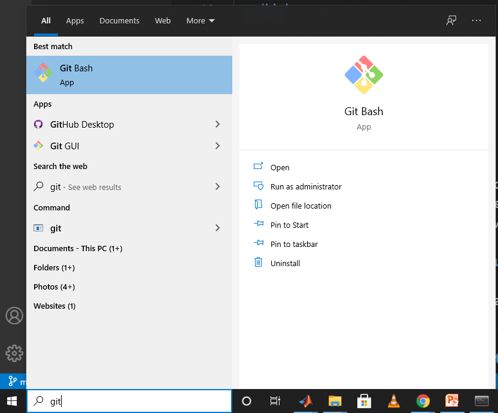
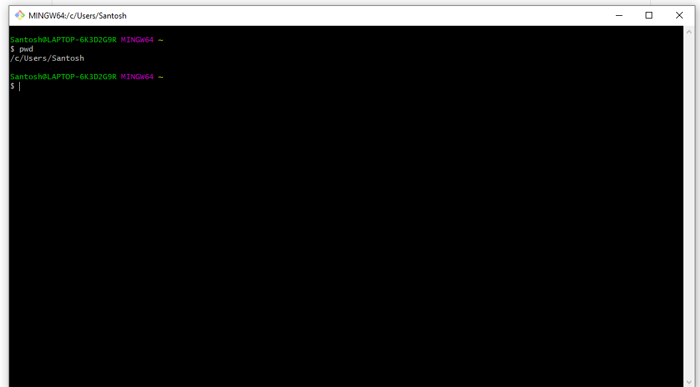
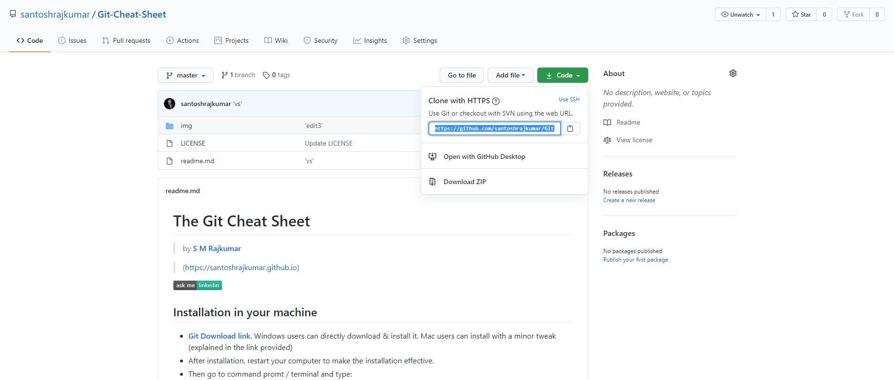
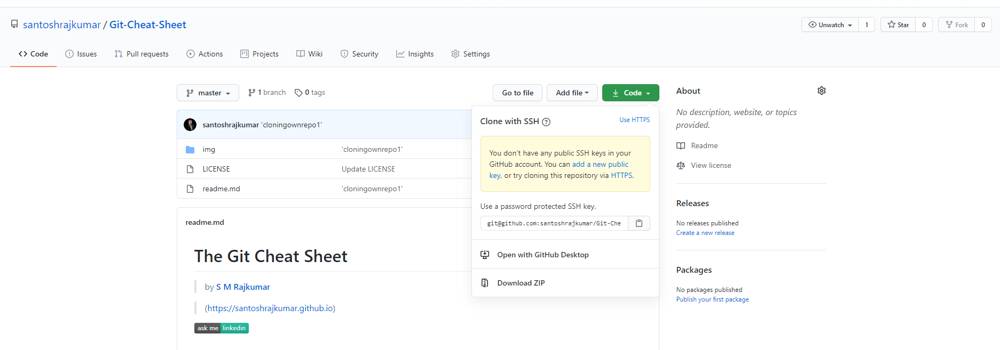
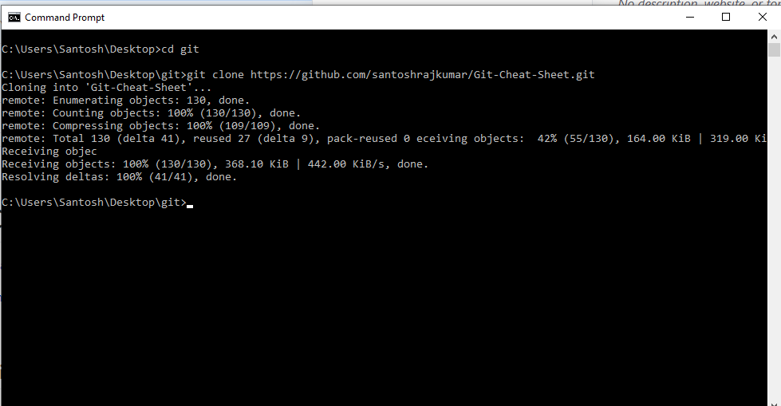
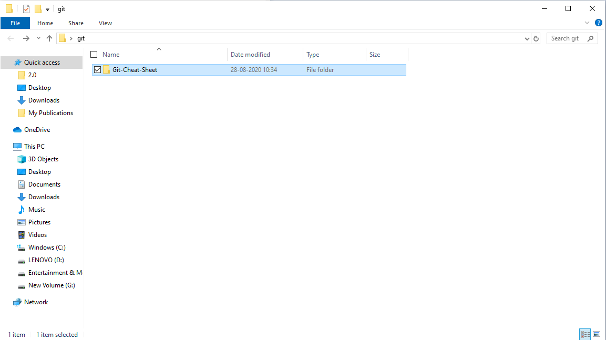
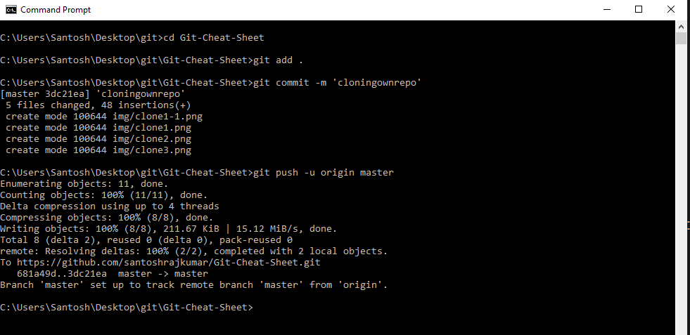

# The Git Cheat Sheet

> by [<b>S M Rajkumar</b>](https://santoshrajkumar.com) 

> (https://santoshrajkumar.com)


[](https://www.linkedin.com/in/santosh-mohan-rajkumar-101180a3/)

## Installation in your machine

* [<b>Git Download link</b>](https://git-scm.com/downloads). Windows users can directly download & install it. Mac users can install with a minor tweak (explained in the link provided)
* After installation, restart your computer to make the installation effective.
* Then go to command promt / terminal and type:
```git
git version
```
If it returns something like below, you're done installing.
```
git version 2.27.0.windows.1
```
* In windows machine you get a terminal with the installation of Git. This is a UNIX based command line. So commands are same in Gitbash with Mac terminal ones.

## Configuring Git for you
* Open command prompt / terminal / GitBash and type:
```
git config --global user.name "YourName"
```
```
git config --global user.email "yourEmail"
```
## GitHub
GitHub is a popular platform for hosting codes of developers collaborating / inside an organization. In github remote repositories can be created to post codes by different collaborators / self.

* Goto https://github.com/ and sign up for an account
* Then login to your github account
* To create one repository, follow the following images:
<p align="center"> 
  <kbd>
    
  </kbd>
</p>

<p align="center"> 
  <kbd>
    
  </kbd>
</p>

* Your repository may be private or public. 
* To add a collaborator to your repository, go to settings inside the repository. Then select manage access and then invite your fellow collaborator.

## Setting up your SSH key for your GitHub account
> *** Please skip this step for initial try. If you find errors in pushing files to your GitHub repository, then only proceed with this step.

* In windows machine, search Git from start menu and open Gitbash. For Mac opening terminal will do.
<p align="center"> 
  <kbd>
    
  </kbd>
</p>

* Keep in mind that commands in Gitbash & Mac terminal are same
* Inside Gitbash / Terminal type ``` pwd ``` & press enter. You should be in your user directory. If not, then navigate to your user directory.

<p align="center"> 
  <kbd>
    
  </kbd>
</p>

* Check for files & folder list in your user directory by typing command ```ls -la```. If that containts a folder with name ```.ssh``` then navigate to it using ```cd .ssh```. Otherwise create a folder namely .ssh by typing ```mkdir .ssh``` and then navigate to it.

* When you are inside the .ssh folder type the following command:
```
ssh-keygen -t rsa
```

* You'll be promted to enter 3 things, don't type anything, just press enter.
* Then you type ```ls -la``` to see if there is a file namely ```id_rsa.pub```. If yes, then type the following command:

```
cat id_rsa.pub
```

* One SSH key will come up. Copy that key.
* Goto your github.com account and then go to account settings. Then select ```SSH and GPG Keys```.
* The under SSH keys, select new SSH key.
* Then you'll be promted to enter title & key. You can keep any title. For the key, enter the SSH key previously copied. Then select Add SSH key .


## Pushing your codes to your empty GitHub repository
* Create any folder in your local machine. Then go inside that folder from command prompt/terminal. An instance in windows machine for a folder in desktop namely 'git-test' is shown below:
<p align="center"> 
  <kbd>
    
  </kbd>
</p>

* Initialize the repository with command:
```
git init
```
* Copy the folder / files you want to push to GitHub repository to the folder (in this case 'git-test'). 
* Then add all the files inside that folder (type in command):
```
git add .
```
* For commiting, enetr in command:
```
git commit -m 'first'
```
* Go to your empty repo inbside github.com, the highlighted part is the address of your repository, copy it and paste it in command:
<p align="center"> 
  <kbd>
    
  </kbd>
</p>

* Finally, push it using command:

``
git push -u origin master
``

* Congratulations ! You have successfully committed files in your local machine to the github.com repository.

<p align="center"> 
  <kbd>
    
  </kbd>
</p>

## Changing files / uploading new files in a non-empty GitHub Repo

* Please keep in mind that you can do so to your own repo and the repos where you are added as collaborator.

* Go to the repo and copy and click on code, a drop-down will appear. Copy the remote repo link. Use HTTPS link or select SSH link if you have set up SSH. For this example case, I am going to show with my own repo Git-Cheat-Cheat.

<p align="center"> 
  <kbd>
    
  </kbd>
</p>

<p align="center"> 
  <kbd>
    
  </kbd>
</p>

* Now navigate to the folder where you want to copy the remote repo (for example a folder named git in my desktop). This is called cloning of a remote repo to your local machine. For this example case Now, enter the following command:
```
git clone <remote repo link>
```

<p align="center"> 
  <kbd>
    
  </kbd>
</p>

* A folder with the repo name (Git-Cheat-Sheet) got created in the directory I chose.

<p align="center"> 
  <kbd>
    
  </kbd>
</p>

* Update the files / folders you want. If there is no change to any of the files / folders, you can't push it.

* After changing the necessary files, navigate to the folder with the repo name & type the following commands:

```
git add .
git commit -m 'yourOwnRefernceWords'
git push -u origin master
```
* Congratulations, you have successfully updated files / folders of a remote repository.

<p align="center"> 
  <kbd>
    
  </kbd>
</p>
