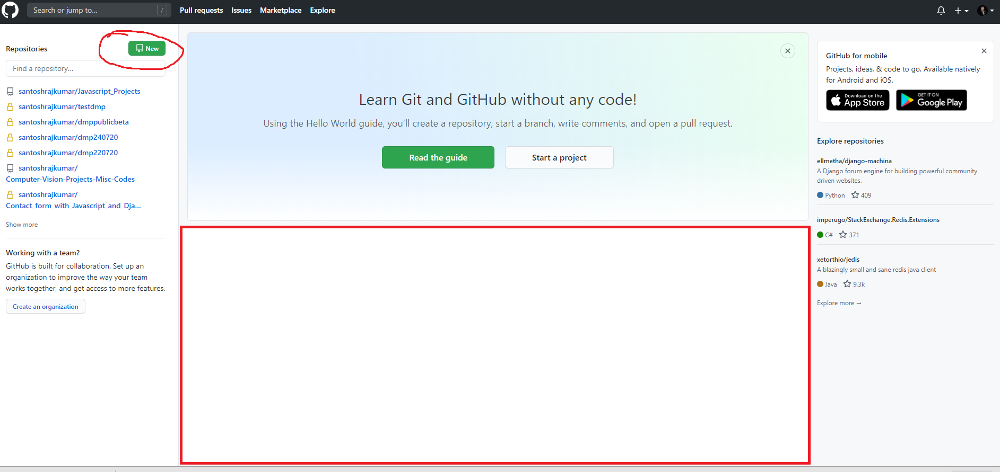
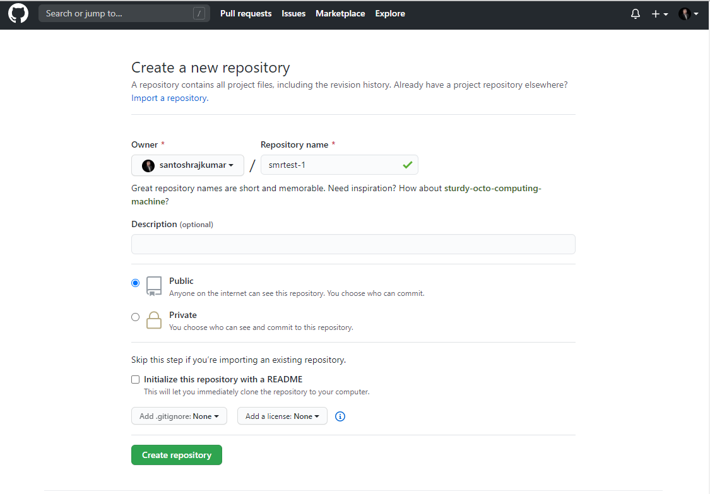
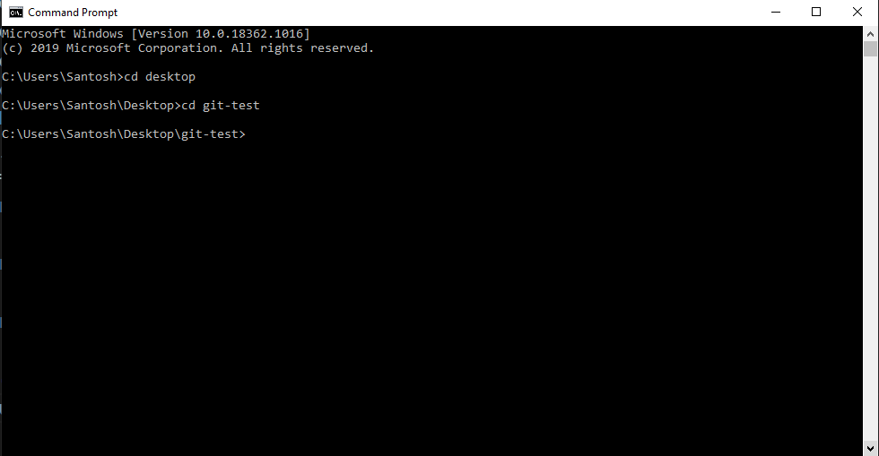
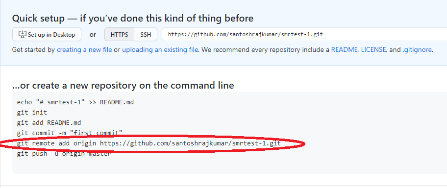
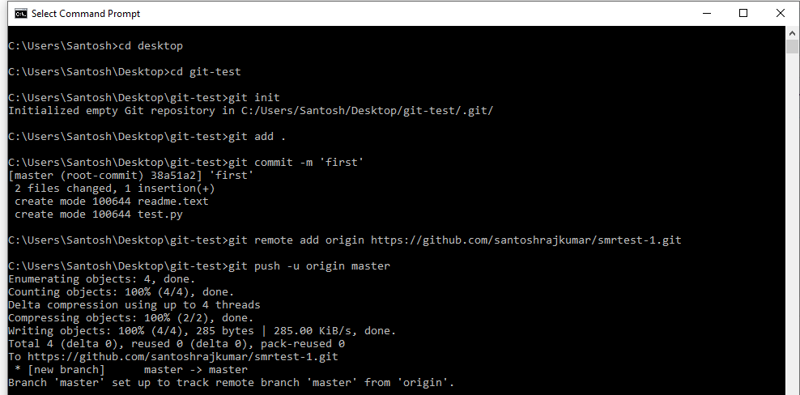

# The Git Cheat Sheet

> by [<b>S M rajkumar</b>](https://santoshrajkumar.github.io) 
> https://santoshrajkumar.github.io


[](https://www.linkedin.com/in/santosh-mohan-rajkumar-101180a3/)

## Installation in your machine

* [<b>Git Download link</b>](https://git-scm.com/downloads). Windows users can directly download & install it. Mac users can install with a minor tweak (explained in the link provided)
* After installation, restart your computer to make the installation effective.
* Then go to command promt / terminal and type:
```git
git version
```
If it returns something like below, you're done installing.
```
git version 2.27.0.windows.1
```

## Configuring Git for you
* Open command prompt / terminal and type:
```
git config --global user.name "YourName"
```
```
git config --global user.email "yourEmail"
```
## GitHub
GitHub is a popular platform for hosting codes of developers collaborating / inside an organization. In github remote repositories can be created to post codes by different collaborators / self.
* Goto https://github.com/ and sign up for an account
* Then login to your github account
* To create one repository, follow the following images:
<p align="center"> 
  <kbd>
    
  </kbd>
</p>

<p align="center"> 
  <kbd>
    
  </kbd>
</p>
* Your repository may be private or public. 
* To add a collaborator to your repository, go to settings inside the repository. Then select manage access and then invite your fellow collaborator.


## Pushing your codes to your empty GitHub repository
* Create any folder in your local machine. Then go inside that folder from command prompt/terminal. An instance in windows machine for a folder in desktop namely 'git-test' is shown below:
<p align="center"> 
  <kbd>
    
  </kbd>
</p>

* Initialize the repository with command:
```
git init
```
* Copy the folder / files you want to push to GitHub repository to the folder (in this case 'git-test'). 
* Then add all the files inside that folder (type in command):
```
git add .
```
* For commiting, enetr in command:
```
git commit -m 'first'
```
* Go to your empty repo inbside github.com, the highlighted part is the address of your repository, copy it and paste it in command:
<p align="center"> 
  <kbd>
    
  </kbd>
</p>

* Finally, push it using command:

``
git push -u origin master
``

* Congratulations ! You have successfully committed files in your local machine to the github.com repository.

<p align="center"> 
  <kbd>
    
  </kbd>
</p>
